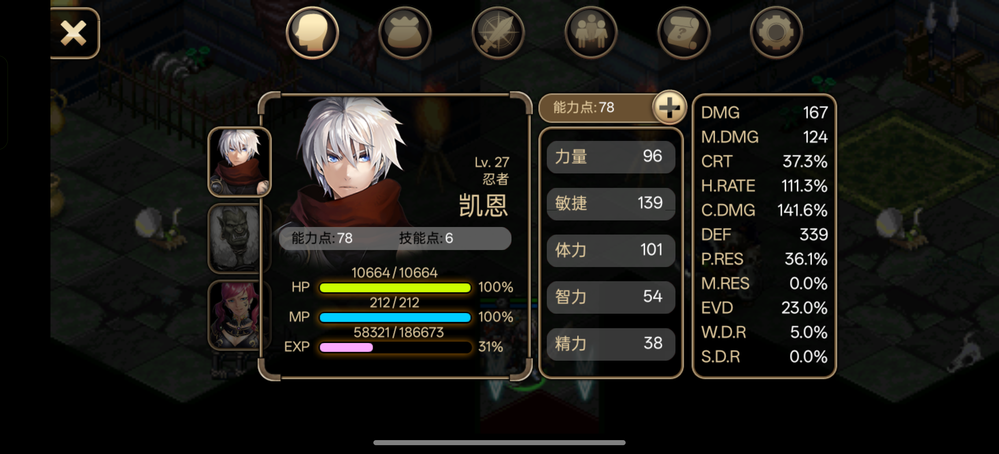

# UI 点击坐标参考

> 记录探索/验证过的 UI 元素点击坐标。**界面状态是坐标的前提**——界面不对找不到元素，坐标不可跨界面复用。

## 使用说明

- 前提必须注明**界面状态**（`docs/api-spec.md` GameState screen 字段：main_menu / world / ui_panel / dialog）
- 截图为可选，截图存档于 `screenshots/`，本文引用
- 坐标均为横屏 **3168x1440** 应用窗口坐标系（与 touch_automation.py 一致）
- 坐标仅记录**验证过（点击命中或确认）**的结果；未经验证的不写入
- UI按钮有一个区域，相近范围的点也能起到同样效果。
- 文档内所有坐标仅用于开发，最终成品中不得使用触摸来进行控制。

## 连续操作

用于 `scripts/touch_automation.py` 的自动点击参数

- 从 main_menu 进入 world
  - click 1700,1200 0.1 click 2000,800 0.3 click 1700,350 1.5 click 1680,1030 0.3 click 1715,750 0.1 click 1715,750 0.1

## 坐标记录

<!-- 后续探索/验证的坐标追加于此，格式：

### 界面状态（screen 值）

| 元素 | 坐标 | 前提 | 说明/效果 | 截图 |
|---|---|---|---|---|
| 元素名称 | (x, y) | 需要位于什么界面或状态 | 点击后打开什么/操作了什么/用途 |  |
-->

### 游戏world按钮

| 元素 | 坐标 | 前提 | 说明/效果 | 截图 |
|---|---|---|---|---|
| 面板按钮 | (231, 754) | 位于world内，无其他打开的弹窗或ui | 从world进入ui_panel，默认为属性ui_panel | 无 |
| 快捷保存按钮 | (280, 420) | 位于world内，无其他打开的弹窗或ui | 快速保存 | 无 |
| 商店按钮 | ( 289, 595) | 位于world内，无其他打开的弹窗或ui | 无用 | 无 |
| 角色1 | (3038,  99) | 位于world内，无其他打开的弹窗或ui | 切换控制角色1 | 无 |
| 角色2 | (3052, 317) | 位于world内，无其他打开的弹窗或ui | 切换控制角色2 | 无 |
| 角色3 | (3069, 533) | 位于world内，无其他打开的弹窗或ui | 切换控制角色3 | 无 |
| 攻击/交互按钮 | (3017,1190) | 位于world内，无其他打开的弹窗或ui |  | 无 |
| 按钮 | (3095, 764) | 位于world内，无其他打开的弹窗或ui |  | 无 |
| 技能/物品使用按钮1 | (2277,1249) | 位于world内，无其他打开的弹窗或ui | 使用该位置上的物品或技能 | 无 |
| 技能/物品使用按钮2 | (2491,1241) | 位于world内，无其他打开的弹窗或ui | 使用该位置上的物品或技能 | 无 |
| 技能/物品使用按钮3 | (2693,1259) | 位于world内，无其他打开的弹窗或ui | 使用该位置上的物品或技能 | 无 |
| 技能/物品使用按钮4 | (2720,1054) | 位于world内，无其他打开的弹窗或ui | 使用该位置上的物品或技能 | 无 |
| 技能/物品使用按钮5 | (2877, 937) | 位于world内，无其他打开的弹窗或ui | 使用该位置上的物品或技能 | 无 |
| 技能/物品使用按钮6 | (3074, 924) | 位于world内，无其他打开的弹窗或ui | 使用该位置上的物品或技能 | 无 |
| 切换技能/物品使用栏按钮 | (3095, 764) | 位于world内，无其他打开的弹窗或ui | 切换到另一个快捷物品/技能使用栏 | 无 |
| d-pad左 | ( 291,1093) | 位于world内，无其他打开的弹窗或ui | 向左移动 | 无 |
| d-pad右 | ( 631,1111) | 位于world内，无其他打开的弹窗或ui | 向右移动 | 无 |
| d-pad上 | ( 474, 948) | 位于world内，无其他打开的弹窗或ui | 向上移动 | 无 |
| d-pad下 | ( 464,1242) | 位于world内，无其他打开的弹窗或ui | 向下移动 | 无 |

### 面板切换

| 元素 | 坐标 | 前提 | 说明/效果 | 截图 |
|---|---|---|---|---|
| 属性面板 | (1007, 127) | 位于ui_panel中，属性/背包/技能/佣兵/任务/选项面板都可以 | 切换到属性面板 | 无 |
| 背包面板 | (1300, 118) | 位于ui_panel中，属性/背包/技能/佣兵/任务/选项面板都可以 | 切换到背包面板 | 无 |
| 技能面板 | (1617, 116) | 位于ui_panel中，属性/背包/技能/佣兵/任务/选项面板都可以 | 切换到技能面板 | 无 |
| 佣兵面板 | (1903, 110) | 位于ui_panel中，属性/背包/技能/佣兵/任务/选项面板都可以 | 切换到佣兵面板 | 无 |
| 任务面板 | (2193, 112) | 位于ui_panel中，属性/背包/技能/佣兵/任务/选项面板都可以 | 切换到任务面板 | 无 |
| 选项面板 | (2478, 116) | 位于ui_panel中，属性/背包/技能/佣兵/任务/选项面板都可以 | 切换到选项面板 | 无 |

#### 属性面板

| 元素 | 坐标 | 前提 | 说明/效果 | 截图 |
|---|---|---|---|---|
| 队伍角色1 | (781, 493) | 位于属性ui_panel中 | 当前显示角色切换为队伍角色1（默认就是这个角色） | 无 |
| 队伍角色2 | (766, 757) | 位于属性ui_panel中 | 当前显示角色切换为队伍角色2 | 无 |
| 队伍角色3 | (771, 992) | 位于属性ui_panel中 | 当前显示角色切换为队伍角色3 | 无 |
| 属性加点按钮 | (2125.0, 342.0) | 位于属性ui_panel中，且位于队伍角色1、不为加点状态 | 点击后进入加点分配界面：五行属性行出现加减箭头、右上角出现 ✓ 确认按钮 |  |

#### 背包面板

| 元素 | 坐标 | 前提 | 说明/效果 | 截图 |
|---|---|---|---|---|
| 队伍角色1 | (781, 493) | 位于背包ui_panel中 | 当前显示装备切换为队伍角色1的装备（默认就是这个角色） | 无 |
| 队伍角色2 | (766, 757) | 位于背包ui_panel中 | 当前显示装备切换为队伍角色2的装备 | 无 |
| 队伍角色3 | (771, 992) | 位于背包ui_panel中 | 当前显示装备切换为队伍角色3的装备 | 无 |
| 背包1 | (2603, 392) | 位于背包ui_panel中 | 切换到第一个背包（默认就是这个背包） | 无 |
| 背包2 | (2617, 546) | 位于背包ui_panel中 | 切换到第二个背包 | 无 |
| 背包3 | (2617, 694) | 位于背包ui_panel中 | 切换到第三个背包 | 无 |
| 背包4 | (2616, 824) | 位于背包ui_panel中 | 切换到第四个背包 | 无 |
| 背包5 | (2605, 987) | 位于背包ui_panel中 | 切换到第五个背包 | 无 |
| 任务物品背包 | (2613,1132) | 位于背包ui_panel中 | 切换到任务物品背包 | 无 |

#### 技能面板

| 元素 | 坐标 | 前提 | 说明/效果 | 截图 |
|---|---|---|---|---|
| 队伍角色1 | (781, 493) | 位于技能ui_panel中 | 当前显示技能切换为队伍角色1的技能（默认就是这个角色） | 无 |
| 队伍角色2 | (766, 757) | 位于技能ui_panel中 | 当前显示技能切换为队伍角色2的技能 | 无 |
| 队伍角色3 | (771, 992) | 位于技能ui_panel中 | 当前显示技能切换为队伍角色3的技能 | 无 |
| 技能目录 | (1750, 496) | 位于技能ui_panel中 | 中间的面板切换为技能目录（默认为这个） | 无 |
| AI设置 | (1733, 708) | 位于技能ui_panel中 | 中间的面板切换为ai技能使用频率设置 | 无 |
| 自动反击设置 | (1754,1009) | 位于技能ui_panel中 | 中间的面板切换为自动反击设置与初始化技能点 | 无 |

#### 佣兵面板

| 元素 | 坐标 | 前提 | 说明/效果 | 截图 |
|---|---|---|---|---|
| 切换佣兵槽位页 | ( 739, 348) | 位于佣兵ui_panel中 | 在佣兵槽位页面1和2之间切换 | 无 |
| 第一个佣兵 | ( 982, 426) | 位于佣兵ui_panel中 | 选中第1个佣兵 | 无 |
| 第二个佣兵 | (1241, 435) | 位于佣兵ui_panel中 | 选中第2个佣兵 | 无 |
| 第三个佣兵 | (1532, 426) | 位于佣兵ui_panel中 | 选中第3个佣兵 | 无 |
| 第四个佣兵 | ( 921, 692) | 位于佣兵ui_panel中 | 选中第4个佣兵 | 无 |
| 第五个佣兵 | (1278, 697) | 位于佣兵ui_panel中 | 选中第5个佣兵 | 无 |
| 第六个佣兵 | (1520, 699) | 位于佣兵ui_panel中 | 选中第6个佣兵 | 无 |
| 第七个佣兵 | ( 911, 971) | 位于佣兵ui_panel中 | 选中第7个佣兵 | 无 |
| 第八个佣兵 | (1238, 944) | 位于佣兵ui_panel中 | 选中第8个佣兵 | 无 |
| 第九个佣兵 | (1522, 989) | 位于佣兵ui_panel中 | 选中第9个佣兵 | 无 |

#### 任务面板

| 元素 | 坐标 | 前提 | 说明/效果 | 截图 |
|---|---|---|---|---|
| 已接取的第一个任务 | (1294, 424) | 位于任务ui_panel中 | 选中第1个任务，通常为主线任务 | 无 |
| 已接取的第二个任务 | (1250, 546) | 位于任务ui_panel中 | 选中第2个任务 | 无 |

#### 选项面板

| 元素 | 坐标 | 前提 | 说明/效果 | 截图 |
|---|---|---|---|---|
| 保存 | (1684, 479) | 位于选项ui_panel中 | 保存按钮 | 无 |
| 帮助 | (1669, 729) | 位于选项ui_panel中 | 帮助按钮 | 无 |
| 保存 | (1703, 965) | 位于选项ui_panel中 | 回到主菜单按钮 | 无 |